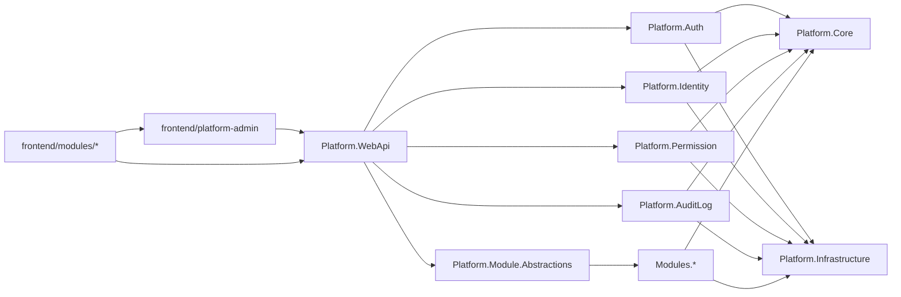

# UniCore

面向 .NET 与 React 生态的可复用平台基座。

## 目标

建立一个可在多个业务项目中直接复用的“平台基座”，统一沉淀以下能力，并支持业务模块按规划扩展：

- 认证登录（Auth）
- 审计与操作日志（Audit/Logging）
- 用户与组织管理（IAM）
- 权限与授权（RBAC，后续可扩展 ABAC）
- 前端管理台基座（登录、菜单、路由权限、通用页面骨架）

## 项目命名

- 项目名称：`UniCore`
- 英文副标题（扩展字段）：`可复用应用基础平台`
- 仓库名称：`unicore-platform`
- .NET 根命名空间：`UniCore`
- 后端模块命名示例：`UniCore.Auth`、`UniCore.Identity`、`UniCore.Permission`、`UniCore.AuditLog`
- 前端工程名（现行）：`platform-admin`（位于 `frontend/platform-admin`）
- 前端包名前缀：`@unicore/*`

## 实施策略

优先采用 **平台内核 + 业务模块契约 + 可发布 NuGet 包 + 脚手架模板**：

- 第一阶段：单仓模块化实现平台内核，降低复杂度，快速跑通
- 第二阶段：固化业务模块接入契约（模块可独立开发）
- 第三阶段：把稳定模块抽成 NuGet 包，供新项目一键复用
- 第四阶段（扩展阶段）：当团队和业务规模上来后，把高负载模块（如认证、审计）独立成服务

这样可以兼顾“现在开发效率”和“未来扩展性”，最适合你“开发其它项目复用”的目标。

## 项目结构

- `src/Platform.Core`：基础领域模型、通用异常、结果封装、领域事件
- `src/Platform.Infrastructure`：EF Core、缓存、消息总线、审计持久化
- `src/Platform.Auth`：JWT/OIDC、刷新令牌、会话黑名单、登录风控接口
- `src/Platform.Identity`：用户、角色、部门/租户、用户状态管理
- `src/Platform.Permission`：权限点（资源-操作）、角色绑定、数据权限扩展点
- `src/Platform.AuditLog`：登录日志、操作日志、安全事件日志
- `src/Platform.WebApi`：统一 API 出口、过滤器、中间件、OpenAPI
- `src/Platform.Module.Abstractions`：业务模块契约（模块注册、权限声明、菜单声明、迁移入口）
- `src/Modules/`：业务模块目录（如 `OrderModule`、`CRMModule`、`InventoryModule`）
- `frontend/platform-admin`：前端基座（登录、布局、动态菜单、权限路由、审计埋点）
- `frontend/modules/`：前端业务模块（按业务拆分页面、路由、API SDK）
- `templates/`：项目脚手架模板（dotnet new）
- `packages/`：内部 NuGet 打包配置与版本策略

## 前端方案（必须纳入复用）

推荐采用 **前后端分离 + 前端模块化**：

- 前端基座负责：登录、Token 管理、路由守卫、动态菜单、统一布局、错误页、国际化、主题
- 前端业务模块负责：业务页面、业务状态管理、业务 API 调用
- 权限控制：后端输出权限点与菜单树，前端按权限点做路由与按钮级控制
- 复用方式：新项目在前端基座上接入新模块，而不是从零搭管理后台
- 一致性：前后端共享权限点命名规范（如 `order.read`、`order.update`）
- 语言策略：前端基座统一 `TypeScript`；业务模块允许 `JavaScript` 渐进接入（通过规范约束保证质量）

前端技术栈（与仓库实现一致）：

- `React + TypeScript + Vite`
- 路由：`react-router-dom`
- 工程化：`npm workspaces`（`frontend/package.json`）
- 请求层：统一 `apiFetch` 封装（自动附带 Token、统一错误处理）
- SDK 生成：`openapi-typescript + PowerShell scripts`

## 前端标准化决策

- 固定标准：`React + TypeScript + Vite`
- 基座代码：必须使用 `TypeScript`，保证模块协议与权限模型类型安全
- 业务模块：允许 `JavaScript` 渐进接入，但需满足以下约束
  - 提供 `JSDoc` 类型注释
  - 启用 `ESLint + Prettier`
  - 对接口输入输出做运行时校验（如 `zod`）
- 演进路径：新模块默认 TypeScript，存量 JS 模块按优先级逐步迁移

## 前端设计系统（全局统一复用）

目标：在业务开发前先沉淀一套统一的视觉与交互规范，后续模块必须基于该规范开发，禁止各模块自定义散乱样式。

### 统一范围（你提到的核心控件）

- 数据表格（Table）：分页、排序、筛选、列配置、空态、加载态、密度
- 按钮（Button）：主次级、危险态、禁用态、尺寸体系、图标规范
- 弹窗（Modal/Drawer）：标题区、内容区、操作区、关闭规则、层级规范
- 输入框与显示框（Input/Display）：表单间距、标签对齐、只读展示样式
- 搜索框（Search）：查询区布局、折叠条件、重置/查询行为一致
- 标题与排版（Typography）：页面标题、区块标题、正文、辅助信息层级
- 主题（Theme）：品牌色、语义色、圆角、阴影、间距、暗黑模式策略
- 提示反馈（Toast/Message/Notification）：成功/失败/警告/信息的文案与样式规范

### 设计系统实施结构

- `frontend/platform-admin/src/design/tokens/`：设计令牌（颜色、字号、间距、圆角、阴影、层级）
- `frontend/platform-admin/src/design/theme/`：主题生成与切换逻辑（含暗色主题）
- `frontend/platform-admin/src/components/base/`：基础组件封装（Button/Input/Modal/Table/Toast）
- `frontend/platform-admin/src/components/patterns/`：业务模式组件（搜索表单、列表页骨架、详情页骨架）
- `frontend/platform-admin/src/styles/`：全局样式入口与 reset、排版、动效规范
- `frontend/platform-admin/src/docs/design-system/`：组件使用规范与示例

### 强制复用机制（关键）

- 禁止业务模块直接改动第三方 UI 库默认样式，必须通过基座组件二次封装
- 业务页面必须优先使用 `components/base` 与 `components/patterns`
- 通过 ESLint 规则限制直接引入原始组件（例如限制直接引入 `antd` 指定组件）
- PR 检查项加入“设计系统合规性”核验（命名、间距、交互一致性）
- 所有新模块以统一页面模板（列表/详情/编辑）起步，减少风格漂移

### 前后端联动要求

- 表格列、筛选项、状态值与后端字典/枚举统一
- Toast 错误提示统一消费后端错误码与错误消息结构
- 搜索与分页参数协议固定，避免每个模块自行约定

## 前端设计规范目录结构

规范文档统一放在 `frontend/platform-admin/src/docs/design-system/`，目录如下：

- `00-governance.md`：规范总则（目标、适用范围、强制级别）
- `01-design-tokens.md`：颜色、字号、间距、圆角、阴影、层级、动效 tokens
- `02-layout-grid.md`：栅格体系、页面骨架、断点与响应式策略
- `03-typography.md`：标题层级、正文层级、文案与可读性规范
- `04-components-base.md`：Button/Input/Modal/Table/Toast 基础组件规范
- `05-components-patterns.md`：搜索区、列表页、详情页、编辑页模式组件规范
- `06-form-rules.md`：表单校验、错误提示、提交与防重复提交规则
- `07-table-search-rules.md`：查询、筛选、分页、空态、批量操作统一规则
- `08-feedback-rules.md`：Toast/Message/Modal/Notification 文案与交互规则
- `09-permission-navigation.md`：菜单、路由、按钮权限与可见性规则
- `10-theme-branding.md`：主题切换、品牌变量、暗黑模式策略
- `11-accessibility-i18n.md`：可访问性与国际化约束
- `12-engineering-enforcement.md`：ESLint/Stylelint 规则与 PR 检查清单
- `13-dos-and-donts.md`：正反例清单（推荐/禁止写法）
- `14-migration-guide.md`：历史模块迁移策略与优先级

### 每章统一模板

每一章都使用同一模板，降低维护成本：

- 章节目标
- 适用范围
- 强制规则
- 推荐规则
- 禁止规则
- 代码示例（推荐/禁止）
- 验收清单

### 角色分工

- 设计负责人：维护 tokens、视觉规范与交互基线
- 前端架构负责人：维护组件封装、工程约束、脚手架模板
- 业务模块负责人：按规范消费组件，不新增私有样式体系
- 评审责任人：PR 中核验“规范合规性”并阻止违规合并

### 验收标准（完成定义）

- 新页面 100% 使用基座组件或模式组件
- 无硬编码视觉变量（颜色/字号/间距等）
- 权限可见性全部由权限点驱动
- 表单、表格、反馈交互符合统一规则
- 通过 lint 规则与 PR 规范检查

## 通用基础模块清单

### 必须现在做（MVP 内纳入）

- 配置中心模块：环境配置、特性开关、敏感配置管理
- 统一异常与错误码模块：标准错误码、追踪 ID、统一错误响应
- 缓存模块：Redis 封装、缓存键规范、失效策略
- 文件与对象存储模块：上传/下载抽象、文件元数据、访问策略
- 健康检查与可观测模块：健康探针、基础指标、日志关联追踪
- 前端 API SDK 自动生成模块：基于 OpenAPI 产出 TypeScript SDK
- 前端权限守卫模块：路由级和按钮级权限控制

### 增强模块（基础能力）

- 通知消息模块：站内信、邮件、短信、Webhook
- 任务调度模块：定时任务、重试、失败告警
- 字典与枚举配置模块：统一字典管理与版本化发布
- 审计增强模块：字段级变更对比（谁在何时修改了什么）
- 多租户与数据隔离模块：租户级隔离策略、租户配置管理
- 前端通用业务组件模块：通用表格/表单/详情页模板化封装
- 前端 i18n 与主题模块：国际化、深浅色主题、品牌化配置

## 业务模块扩展模式（重点）

每个新业务项目不再重建登录/权限/用户/日志，而是只新增自己的业务模块：

- 基座提供：认证、鉴权、审计、用户中心、统一配置、统一异常与日志
- 业务模块提供：领域模型、业务 API、模块迁移、模块权限点、模块菜单
- 接入方式：实现统一模块接口（如 `IBusinessModule`），启动时自动发现并注册
- 生命周期：模块可以独立发布版本，但依赖同一套平台协议版本
- 治理约束：模块必须声明权限点和审计策略，避免“功能有了但不可管控”
- 前后端协同：每个业务模块同时提交后端权限声明和前端路由/菜单声明

### 业务模块最小契约

每个业务模块至少要提供以下内容，才能进入主干分支：

- 模块元信息：`moduleCode`、`moduleName`、`moduleVersion`
- 后端注册：服务注册入口、路由注册入口、数据库迁移入口
- 权限声明：模块级权限点清单（含默认角色配置参考）
- 菜单声明：菜单树、路由路径、页面权限映射
- 审计声明：关键操作事件与审计级别
- 前端导出：`routes`、`menu`、`permissions`、`api`

## 核心设计原则

- 统一身份：默认 `JWT + Refresh Token`，支持后续接入外部 IdP（Azure AD/Keycloak）
- 统一授权：先做 RBAC（用户-角色-权限点），预留数据权限接口
- 统一审计：所有关键动作（登录、权限变更、用户状态变更）必须可追溯
- 统一扩展：通过接口与事件机制（如 `IUserLifecycleHook`）支持业务侧插拔
- 统一初始化：新项目通过模板命令创建并自动接入基础模块
- 统一契约：任何业务模块必须遵循模块接入契约（路由、权限、审计、迁移）

## 模块关系




## 分阶段实施

1. **MVP（2-4 周）**
  - 设计系统底座：完成 tokens、主题、基础组件（Button/Input/Modal/Table/Toast）
  - 页面骨架：完成列表页、详情页、表单页三类标准模板
  - 登录：账号密码登录、JWT、刷新令牌、登出
  - 用户管理：用户增删改查、启停用、重置密码
  - 权限管理：角色管理、权限点分配、接口鉴权
  - 日志：登录日志、操作日志、统一审计中间件
  - 配置中心：统一配置读取、特性开关、敏感配置管理
  - 统一异常：统一错误码、统一异常处理中间件、追踪 ID 透传
  - 缓存能力：Redis 接入与缓存规范
  - 文件能力：本地/对象存储统一抽象
  - 可观测性：健康检查与基础监控指标
  - 前端基座：登录页、主布局、动态菜单、路由守卫、权限指令（按钮级）
  - 前端工程化：OpenAPI 到 TypeScript SDK 自动生成
2. **模块化复用（1-2 周）**
  - 定义业务模块接入契约（接口、约定、模板）
  - 抽公共配置与扩展点
  - 提供 `BusinessModule` 脚手架（自动带权限声明、审计拦截、迁移入口）
  - 提供前端模块脚手架（TypeScript 默认，支持 JS 模式；自动带路由、菜单、权限点映射、API SDK、标准页面模板）
  - 打包内部 NuGet
  - 输出项目模板（`dotnet new`）
3. **增强（扩展阶段）**
  - 多租户隔离
  - SSO/OIDC 对接
  - 数据权限模型
  - 安全增强（2FA、风控策略、异常告警）
  - 通知中心、任务调度、字典中心、字段级审计增强
  - 前端通用业务组件库、i18n 与主题体系

## 里程碑与验收指标

### 里程碑 M1：平台 MVP 可运行

- 验收标准
  - 完成登录、用户、角色、权限、审计、前端基座主流程
  - 能通过模板创建一个示例业务模块并正常挂载
  - 核心 API 与前端页面可联调通过
- 量化指标
  - 关键主流程（登录、授权、用户管理）可用率达到预期
  - 覆盖 Auth/Permission/Audit 的核心自动化测试

### 里程碑 M2：跨项目复用能力验证

- 验收标准
  - 通过 `dotnet new` 初始化新项目并接入基座成功
  - 在新项目中新增 1 个业务模块且不复制基座代码
  - 前端模块可按模板在同一套设计系统下快速实施
- 量化指标
  - 新项目初始化时间明显低于从零搭建
  - 新模块从创建到首个可用页面在预期工时内完成

### 里程碑 M3：治理闭环

- 验收标准
  - 设计系统、权限规范、审计规范全部进入 PR 检查流程
  - 版本管理、变更日志、发布流程形成标准文档
  - 历史模块迁移指南可用于存量项目迁移

## 能力清单与实施说明

### 平台基础能力

- 定义四大模块边界与接口契约
- 登录/用户/权限/审计 MVP 主链路
- 业务模块接入契约（含迁移与事件扩展声明）
- 前端设计系统规范文档框架
- 接入文档与审计导出专项文档

### 能力清单

- 内部 NuGet 抽包与版本化（补齐依赖与扩展模块集成，维持语义化版本）
- 通用基础模块补齐（健康检查、指标、配置读取、缓存、本地文件存储、Redis、对象存储接入）
- 前端 OpenAPI SDK 自动化（`sdk:generate`、`sdk:check`、导出与校验脚本已可用）
- 多租户基础能力（`tenant_id` 贯穿用户/角色/审计/导出/通知/调度）
- SSO 对接最小闭环（外部身份绑定 + SSO 登录换发平台令牌）
- 数据权限最小模型（`Self`/`Tenant` 数据范围 + 角色配置接口）
- 通知中心 MVP（站内信 + Webhook + 失败重试记录）
- 任务调度中心 MVP（定时扫描、失败重试、任务状态追踪）
- 通知中心短信渠道补齐（SMS Provider 配置、发送接口、失败重试任务）

## 增强能力说明（基线）

本节记录平台能力说明与治理基线，兼顾现状描述与后续演进方向。

### A. OpenAPI -> TypeScript SDK 自动化发布

- 能力说明
  - OpenAPI 文档由 `src/Platform.WebApi` 启动后通过 Swagger 暴露
  - 生成产物位于 `frontend/platform-admin/src/api/sdk/unicore-sdk.ts`
  - 本地使用 `npm run -w platform-admin sdk:generate` 生成并做格式化、lint、编译校验
  - CI 使用 `npm run -w platform-admin sdk:check` 对比差异并阻断“后端变更但 SDK 未更新”的合并
- 目标效果
  - 后端 API 变更可在同一 PR 或后续流水线中产生 SDK 变更
  - 前端通过 SDK 统一访问接口，减少手写 URL 和类型漂移
  - 生成产物可重复、可追踪，并可与版本/变更日志对齐
- 治理要点与演进方向
  - 现行方式以内置源码消费，尚未单独发布 npm 包
  - 若后续拆包，包名可采用 `@unicore/sdk`，并按 `major/minor/patch` 管理版本

### B. 核心增强能力

#### B1. 多租户与数据隔离

- 能力说明
  - `tenant_id` 已贯穿用户、角色、审计、导出、通知、调度等核心链路
  - 请求上下文已支持租户识别并参与数据访问控制
- 目标效果
  - 基础场景下可实现租户数据隔离，避免跨租户裸读
  - 审计日志可关联租户维度进行追踪
- 治理要点与演进方向
  - 存量表和边缘查询仍需持续做 `tenantId` 约束巡检
  - 跨租户访问需要保持显式权限点与审计双重门禁

#### B2. SSO / OIDC 对接

- 能力说明
  - 支持外部身份绑定与 SSO 登录后换发平台令牌的最小闭环
  - 支持与本地账号体系并存
- 目标效果
  - 单点登录后可进入平台并加载权限菜单
  - 登录失败路径具备可识别的错误与审计记录
- 治理要点与演进方向
  - 角色映射的可视化与多 Provider 标准化仍需增强
  - 绑定冲突的人审流程可继续产品化

#### B3. 数据权限模型

- 能力说明
  - 提供 `Self` / `Tenant` 最小数据范围模型与角色配置接口
  - 后端具备校验/解析/拼装/历史/回滚/差异接口，前端治理页面已接入权限控制
- 目标效果
  - 同一接口在不同角色下可返回不同范围的数据集合
  - 策略变更具备可追溯与回滚能力
- 治理要点与演进方向
  - 更细粒度范围（如本部门/自定义表达式策略模板）可继续标准化
  - 复杂表达式性能与安全边界需要持续压测和审计

#### B4. 通知中心（站内信 / Webhook / 短信基础版）

- 能力说明
  - MVP 覆盖站内信、Webhook，短信渠道提供基础能力
  - 提供 `NotificationChannels:Sms` 配置、`/api/notifications/sms` 发送接口与 `notification.sms.retry` 重试任务
- 目标效果
  - 同一业务事件可进行多渠道投递
  - 失败重试与失败记录可查询
- 治理要点与演进方向
  - 邮件渠道与更完整的 Provider 插件化能力仍待补齐
  - 模板版本化与回滚流程可继续细化

#### B5. 任务调度中心

- 能力说明
  - 提供定时扫描、失败重试、任务状态追踪等 MVP 能力
  - 关键任务可通过通知链路告警
- 目标效果
  - 任务执行过程具备基础可观测性（状态、耗时、错误）
  - 失败任务可重试并可结合幂等约束降低重复执行影响
- 治理要点与演进方向
  - 人工补偿流程与更细粒度并发控制仍需完善
  - 调度规则治理（超时、重试、熔断）可进一步平台化

### C. 分阶段实施（按实际优化）

说明：以下阶段用于组织能力演进优先级与资源投入节奏。

- Phase P1（稳定性与治理收口，1-2 周）
  - 目标：先补齐高风险治理短板，确保现有能力可持续运行
  - 重点事项：数据权限策略模板化、调度超时/重试/熔断规则标准化、关键链路监控告警补齐
  - 进入条件：生产/测试环境无阻断性故障
  - 完成判定：形成统一治理规范并在至少 1 条核心业务链路验证通过
- Phase P2（能力补齐，2 周）
  - 目标：补齐通知与调度的“可运营”能力
  - 重点事项：通知中心邮件渠道接入、Provider 插件化抽象、调度中心人工补偿流程
  - 进入条件：P1 的治理规范已生效并纳入 PR 检查
  - 完成判定：邮件发送、重试、失败追踪、人工补偿具备端到端闭环
- Phase P3（平台化增强，2 周）
  - 目标：增强跨租户与身份体系的可扩展性
  - 重点事项：多租户高级配置治理（审计、迁移工具）、SSO 多 Provider 标准接入、角色映射增强
  - 进入条件：P2 形成稳定运行两周以上且无 P1 级回退
  - 完成判定：新增 Provider 或租户配置变更可在不改核心代码前提下完成接入
- Phase P4（工程化发布治理，扩展阶段）
  - 目标：降低前后端协议演进成本
  - 重点事项：SDK 拆包发布可行性推进（如 `@unicore/sdk`）、版本策略与变更日志流程固化
  - 进入条件：P1-P3 均稳定，且存在跨项目复用 SDK 的明确需求
  - 完成判定：形成可复用发布流水线与版本门禁，支持按语义化版本稳定升级

### D. 统一完成定义（Done）

- 功能完成：接口、前端页面、配置项、日志与审计齐全
- 工程完成：测试、lint、文档、发布脚本齐全
- 运维完成：监控、告警、回滚预案齐全
- 治理完成：权限点、错误码、审计事件全部纳入规范

## 环境与发布策略

- 环境分层：`dev` / `test` / `staging` / `prod`
- 配置策略：环境变量 + 配置中心，敏感配置统一托管
- 发布策略：基座模块采用语义化版本；业务模块独立版本但受协议版本约束
- 兼容策略：明确 LTS 支持窗口，避免频繁破坏性升级
- 回滚策略：发布失败可按模块回滚（NuGet 版本回退 + 前端包版本回退）

## 企业级交付基线

- 容器化：仓库根目录提供 `Dockerfile` 与 `.dockerignore`，可构建 `Platform.WebApi` 生产镜像。
- 本地编排：提供 `docker-compose.enterprise.yml`（PostgreSQL + Redis + WebApi）用于企业环境预演。
- 集群基线：提供 `deploy/k8s/unicore-webapi.yaml` 与 `deploy/k8s/README.md` 作为 Kubernetes 最小部署模板。
- 发布前置检查：提供 `scripts/release/preflight-enterprise.ps1`，统一执行后端构建/测试、前端质量、镜像构建、迁移脚本生成校验。
- 发布脚本：`scripts/release/deploy.ps1` 支持 `-RunPreflight` 与 `-InitDatabase`，可串行执行“前置校验 -> 数据库初始化 -> 迁移 -> 发布流程”。

## 全新部署数据库初始化（PostgreSQL）

全新环境建议采用“先建库，再迁移，后启动”：

1. 创建应用数据库账号与空数据库（推荐使用脚本）
2. 执行 EF Core 迁移
3. 启动应用

示例（在仓库根目录执行）：

```powershell
pwsh ./scripts/release/init-postgres.ps1 `
  -Host 127.0.0.1 `
  -Port 5432 `
  -AdminUser postgres `
  -AdminPassword (Read-Host "Postgres admin password" -AsSecureString) `
  -AppUser unicore_app `
  -AppPassword (Read-Host "UniCore app password" -AsSecureString) `
  -DatabaseName unicore_prod
```

迁移命令：

```powershell
dotnet ef database update --project src/Platform.Infrastructure/Platform.Infrastructure.csproj --startup-project src/Platform.WebApi/Platform.WebApi.csproj
```

如需由 DBA/发布平台执行 SQL，可生成幂等脚本：

```powershell
dotnet ef migrations script --idempotent --project src/Platform.Infrastructure/Platform.Infrastructure.csproj --startup-project src/Platform.WebApi/Platform.WebApi.csproj
```

说明：

- 生产环境建议 `Database:ApplyMigrationsOnStartup=false`，由发布流水线先迁移再启动。
- 迁移包含 `pg_trgm` 相关语句，请确保执行迁移的数据库账号具备安装扩展（或由 DBA 预先安装）的权限。

## 风险清单与缓解

- 风险：模块边界不清导致基座“越做越重”  
缓解：严格执行模块契约和架构评审门禁
- 风险：前端规范执行依赖自觉，最终失控  
缓解：lint 规则 + PR checklist + 模板强约束
- 风险：权限点命名混乱导致鉴权成本上升  
缓解：权限点命名规范集中维护并版本化
- 风险：新旧项目并行导致迁移阻力大  
缓解：提供迁移脚本、兼容层与渐进迁移指南
- 风险：基础能力变更影响多个项目稳定性  
缓解：基座模块灰度发布、回归测试与版本冻结窗口

## 执行顺序（第 1 周，对齐 P1）

- Day 1：确认 P1 范围与基线（数据权限模板化、调度治理规则、监控告警清单），冻结本周变更边界
- Day 2：完成数据权限治理规范初稿并在 1 条核心业务链路接入（含策略命名、变更记录、回滚约束）
- Day 3：完成调度规则治理实施（超时/重试/熔断参数模板 + 默认值 + 异常分级处理）
- Day 4：补齐关键链路监控与告警（覆盖成功率、失败率、重试次数、超时任务），并做一次演练
- Day 5：做端到端验收与发布评审，输出 P1 周报（结果、遗留问题、下周进入条件）

## 关键技术选型（.NET）

- Web：ASP.NET Core
- ORM：EF Core（配合迁移规范）
- 认证：Microsoft JWT Bearer + 扩展方案 OpenIddict/IdentityServer
- 缓存：Redis
- 日志：Serilog + Elasticsearch/Loki（二选一）
- 文档：Swashbuckle/OpenAPI
- 权限校验：Policy-based Authorization + 自定义 PermissionHandler

## 质量与治理要求

- 测试：Auth、Permission、Audit 三块至少单元+集成测试
- 安全：密码加密策略、token 失效机制、登录失败限制
- 可观测：请求追踪 ID、审计检索、关键告警
- 版本：语义化版本（SemVer），模块独立变更日志

## 交付物清单

- 可运行的基础平台样板工程
- 3-5 个可复用 NuGet 包
- `dotnet new` 项目模板
- `BusinessModule` 模块模板（新模块 30 分钟内可起步）
- 前端管理台基座与前端业务模块模板
- OpenAPI 到 TypeScript SDK 自动生成流程
- 前端设计系统文档（组件 API、视觉规范、交互规范、Do/Don't）
- 权限点命名规范与审计规范文档
- 项目接入指南（半天可接入）

## 审计导出异步任务说明

### 1) 导出任务完成即回调

- 接口：`POST /api/audit/exports`
- 请求体支持扩展字段 `callbackUrl`（仅允许 `http/https` 绝对地址）
- 当导出任务处理结束（`Completed` 或 `Failed`）时，系统会向 `callbackUrl` 发送 `POST` JSON 回调
- 回调失败（网络异常或非 2xx）不影响任务最终状态与下载能力，仅记录告警日志

回调数据字段：

- `jobId`
- `status`
- `createdBy`
- `createdAt`
- `completedAt`
- `error`
- `downloadUrl`

### 2) 过期任务清理服务化

- 清理逻辑由“应用启动时执行一次”调整为 `HostedService` 周期执行
- 新增配置节：`AuditExportCleanup`
  - `Enabled`：是否启用后台清理
  - `Ttl`：任务保留时长，超出即删除
  - `RunInterval`：定时清理周期

默认配置（`src/Platform.WebApi/appsettings.json`）：

```json
"AuditExportCleanup": {
  "Enabled": true,
  "Ttl": "24:00:00",
  "RunInterval": "00:30:00"
}
```

### 3) 验证说明

- 集成测试覆盖：
  - 合法回调可收到通知
  - 非法 `callbackUrl` 返回参数错误
  - 回调返回非 2xx 不影响任务完成
  - 后台定时清理可按配置生效

## 默认决策（可调整）

- 架构：模块化单体优先
- 权限模型：RBAC 优先，预留 ABAC
- 数据库：PostgreSQL（若你团队以 SQL Server 为主可替换）
- 网关：暂不强制引入，后续按服务化再接入

## 已落地内容

- 平台后端模块化骨架：Core / Auth / Identity / Permission / AuditLog / Module.Abstractions / WebApi
- MVP 级接口链路：登录、用户查询、角色权限、审计事件写入与查询
- 业务模块最小契约：模块元信息、服务注册、路由注册、权限声明、菜单声明、审计声明
- 平台基础能力：健康检查、Prometheus 指标、配置读取、内存缓存、本地文件存储
- 前端基座目录与设计系统文档框架
- `dotnet new` 模板与 NuGet 打包能力（已可用于初始化与发布）
  - 模板定义：`templates/*/.template.config/template.json`
  - 打包脚本：`packages/build/pack.ps1`
- 数据权限治理前端可视化页面（表达式校验/解析/拼装/历史/回滚）

## 快速开始

1. 使用 .NET 10 SDK
2. 打开 `src/Platform.WebApi/Platform.WebApi.csproj`
3. 运行 WebApi 项目

### 一键创建新项目（推荐）

在仓库根目录执行：

```powershell
.\new-project.ps1 -ProjectName AcmeOpsPlatform -DestinationRoot e:\Projects -ModuleName OrderModule -ModuleCode order
.\new-project.ps1 -ProjectName AcmeOpsPlatform -DestinationRoot e:\Projects -ModuleName OrderModule -ModuleCode order -SecondModule CrmModule:crm
.\new-project.ps1 -ProjectName AcmeOpsPlatform -DestinationRoot e:\Projects -ModuleName OrderModule -ModuleCode order -AdditionalModules CrmModule:crm,InventoryModule:inventory
.\new-project.ps1 -ProjectName AcmeOpsPlatform -DestinationRoot e:\Projects -ModuleCodes order,crm,inventory
.\new-project.ps1 -ProjectName AcmeOpsPlatform -Profile erp -DestinationRoot e:\Projects
.\new-project.ps1 -ListProfiles
.\new-project.ps1 -ConfigFile .\new-project.config.sample.json
.\new-project.ps1 -ProjectName AcmeOpsPlatform -DestinationRoot e:\Projects -ModuleCodes order,crm -RunSmoke
```

参数说明：

- `ProjectName`：新平台项目名（必填）
- `DestinationRoot`：项目创建目录（默认使用当前仓库的上一级目录）
- `ModuleName`：可选，初始化一个业务模块项目名（如 `OrderModule`）
- `ModuleCode`：可选，业务模块代码（如 `order`，需与 `ModuleName` 一起传入）
- `SecondModule`：可选，第二个模块快捷参数，格式 `ModuleName:moduleCode`（如 `CrmModule:crm`）
- `AdditionalModules`：可选，批量模块列表，格式 `ModuleName:moduleCode`（如 `CrmModule:crm,InventoryModule:inventory`）
- `ModuleCodes`：可选，仅传模块代码批量创建，自动生成模块名（如 `order,crm` => `OrderModule`、`CrmModule`）
- `ConfigFile`：可选，读取 JSON 配置文件执行初始化（参数优先级高于配置文件）
- `Profile`：可选，加载预置场景模块组合（如 `erp`、`crm`、`ops`）
- `ListProfiles`：可选，列出当前仓库内置的场景配置
- `SkipTemplateInstall`：可选，跳过模板安装（本机已安装模板时可用）
- `RunSmoke`：可选，项目创建后自动执行 `scripts/bootstrap-smoke.ps1` 进行基础验收

该脚本会自动完成：

- 安装 `unicore-platform` 与 `unicore-module` 本地模板（可选跳过）
- 创建新的平台项目目录
- 按需创建一个或多个业务模块骨架
- 若创建了业务模块：自动将所有模块项目加入解决方案，并自动为 `Platform.WebApi` 添加模块项目引用

配置文件示例见：`new-project.config.sample.json`。
预置场景配置目录：`bootstrap-profiles/`。
场景说明文档：`bootstrap-profiles/README.md`。
发布与回滚流程：`docs/release-process.md`。
企业级就绪清单：`docs/enterprise-readiness.md`。
版本兼容矩阵：`docs/compatibility-matrix.md`。
LTS 支持策略：`docs/lts-support-policy.md`。
SLO/SLI 基线：`docs/slo-sli.md`。

参数覆盖优先级（高 -> 低）：

- 命令行参数
- `ConfigFile`
- `Profile`

使用提示：

- `ModuleCodes` 同时支持两种写法：`-ModuleCodes order,crm,inventory` 或 `-ModuleCodes order crm inventory`
- Windows PowerShell 环境下建议直接运行仓库内脚本文件（不要复制到会改编码的编辑器后另存），避免中文提示乱码

### bootstrap-e2e（CI 端到端复用闭环）

仓库内置工作流：`.github/workflows/bootstrap-e2e.yml`，用于在 CI 自动完成：

- 创建临时平台项目
- 自动挂载至少两个业务模块（默认 `order` + `crm`）
- 启动临时后端并执行模块合同检查（含 breaking 校验）
- 执行 `bootstrap-smoke` 基础验收

本地手动复现可执行：

```powershell
.\scripts\bootstrap-e2e.ps1
.\scripts\bootstrap-e2e.ps1 -ModuleCodes order crm inventory
.\scripts\bootstrap-e2e.ps1 -KeepTemporaryProject
```

CI 中该工作流会在 `always()` 场景上传 `bootstrap-e2e-artifacts-*` 工件（含 `report.json`、`summary.md`、后端日志），并自动写入 GitHub Step Summary，便于快速定位失败原因。
工作流默认在 `ubuntu-latest` 与 `windows-latest` 双平台矩阵执行，并在运行前对 `new-project.ps1`、`scripts/bootstrap-smoke.ps1`、`scripts/bootstrap-e2e.ps1` 进行语法预检，降低跨平台脚本兼容风险。

### scripts-quality（脚本质量门禁）

仓库内置 `.github/workflows/scripts-quality.yml`，用于在 CI 中校验仓库 PowerShell 脚本语法：

- `pwsh` 解析器：`ubuntu-latest` + `windows-latest`
- Windows PowerShell 解析器：`windows-latest`

统一校验脚本：`scripts/validate-powershell-scripts.ps1`。

### CI 稳定性清单

当出现 “本地可过、CI 失败” 时，优先参考：`docs/ci-stability-checklist.md`

## 审计导出异步任务

详细说明见：`docs/audit-export.md`

### 创建任务

- 接口：`POST /api/audit/exports`
- 请求体新增可选字段：`callbackUrl`（仅允许 `http/https` 绝对地址）
- 若 `callbackUrl` 非法，接口返回 `400`，错误码 `COMMON.VALIDATION_ERROR`

示例请求：

```json
{
  "filter": {
    "httpMethod": "GET",
    "requestPath": "/api/identity/users",
    "limit": 10
  },
  "fields": ["occurredAt", "eventCode", "actor"],
  "callbackUrl": "https://your-service.example.com/audit-export-callback"
}
```

### 完成即回调（成功/失败都会推送）

- 任务处理结束后，系统会对 `callbackUrl` 发送 `POST` JSON
- 回调失败（网络异常或非 2xx）不会影响任务状态与下载能力，仅记录告警日志
- 可通过 `AuditExportCallback:SigningKey` 开启 HMAC 签名头（未配置则不签名）

签名相关请求头：

- `X-UniCore-Event`: 固定值 `audit-export.completed`
- `X-UniCore-Timestamp`: Unix 秒级时间戳
- `X-UniCore-Nonce`: 随机 nonce（每次回调不同）
- `X-UniCore-Signature`: `HMACSHA256(signingKey, $"{timestamp}.{nonce}.{rawBody}")` 的十六进制字符串

回调 payload：

```json
{
  "jobId": "2de93cd9-d669-4f4f-b670-9ebf3af690b9",
  "status": "Completed",
  "createdBy": "admin",
  "createdAt": "2026-04-15T10:00:00.0000000+00:00",
  "completedAt": "2026-04-15T10:00:01.0000000+00:00",
  "error": null,
  "downloadUrl": "http://localhost:5000/api/audit/exports/2de93cd9-d669-4f4f-b670-9ebf3af690b9/download"
}
```

`status` 可能值：

- `Completed`
- `Failed`

### 后台定时清理（HostedService）

- 清理逻辑已改为后台服务周期执行，不再只是启动时清理一次
- 配置节：`AuditExportCleanup`

`src/Platform.WebApi/appsettings.json` 默认值：

```json
"AuditExportCallback": {
  "SigningKey": ""
},
"AuditExportCleanup": {
  "Enabled": true,
  "Ttl": "24:00:00",
  "RunInterval": "00:30:00"
}
```

配置含义：

- `Enabled`：是否启用清理服务
- `Ttl`：导出任务保留时长，超出后会被删除
- `RunInterval`：清理任务执行周期

## 健康检查

- 存活检查：`GET /api/health/live`
- 就绪检查：`GET /api/health/ready`
- 兼容健康接口：`GET /api/health`
- 指标接口：`GET /metrics`（Prometheus 文本格式）

`/api/health/ready` 已包含数据库连通性检查（`database`）。

## 平台基础能力接口

- 配置读取：`GET /api/platform/config/features`
- 缓存写入：`POST /api/platform/cache/{key}`
- 缓存读取：`GET /api/platform/cache/{key}`
- 缓存删除：`DELETE /api/platform/cache/{key}`
- 文件上传：`POST /api/platform/files/upload`（`multipart/form-data`，字段名 `file`）
- 文件下载：`GET /api/platform/files/{fileId}`

## 模块契约治理报告

用于对当前已加载业务模块进行契约合规性校验，并输出治理报告（JSON/CSV）。

### 校验接口

- `POST /api/modules/contracts/validate`
- 请求体可选：`protocolVersion`（如 `1.0.0`）
- 返回：整体是否通过、错误/告警统计、按模块明细

示例请求：

```json
{
  "protocolVersion": "1.0.0"
}
```

### 报告接口

- JSON 报告：`GET /api/modules/contracts/report?protocolVersion=1.0.0`
- CSV 报告：`GET /api/modules/contracts/report?protocolVersion=1.0.0&format=csv`
- CSV 下载：`GET /api/modules/contracts/report/download?protocolVersion=1.0.0`

### 当前校验项

- `moduleCode` 必填、格式校验、唯一性校验
- `moduleVersion` 必填、SemVer 校验
- 模块主版本与协议主版本兼容性提醒
- 权限点重复检测
- 菜单编码重复检测
- 菜单引用未声明权限点提醒
- 审计事件级别合法性提醒

## 接入指南

- 审计导出：`docs/audit-export.md`
- 业务模块接入：`docs/module-integration-guide.md`

## 目录

- `src/` 后端平台模块
- `frontend/platform-admin/` 前端基座与设计系统文档
- `templates/` `dotnet new` 模板（业务模块模板、平台模板）
- `packages/` 内部 NuGet 策略与打包脚本

