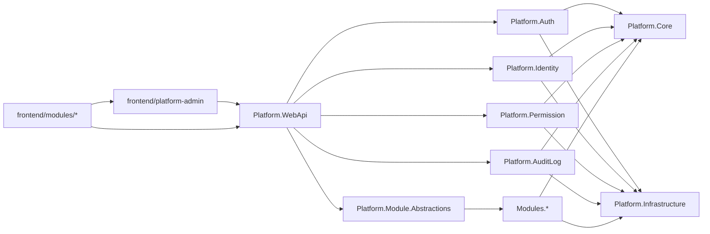

# UniCore 规划与建设计划

> 状态标注规则：每条事项统一使用 **【已完成】** / **【未完成】**。

## 目标

建立一个可在多个业务项目中直接复用的“平台基座”，统一沉淀以下能力，并支持业务模块按需扩展：

- 认证登录（Auth）
- 审计与操作日志（Audit/Logging）
- 用户与组织管理（IAM）
- 权限与授权（RBAC，后续可扩展 ABAC）
- 前端管理台基座（登录、菜单、路由权限、通用页面骨架）

## 项目命名（已确认）

- 项目名称：`UniCore`
- 英文副标题（可选）：`Reusable Application Foundation`
- 仓库建议名：`unicore-platform`
- .NET 根命名空间：`UniCore`
- 后端模块命名示例：`UniCore.Auth`、`UniCore.Identity`、`UniCore.Permission`、`UniCore.AuditLog`
- 前端工程名建议：`unicore-admin`
- 前端包名前缀建议：`@unicore/*`

## 推荐落地策略

优先采用 **平台内核 + 业务模块契约 + 可发布 NuGet 包 + 脚手架模板**：

- 第一阶段：单仓模块化实现平台内核，降低复杂度，快速跑通
- 第二阶段：固化业务模块接入契约（模块可独立开发）
- 第三阶段：把稳定模块抽成 NuGet 包，供新项目一键复用
- 第四阶段（可选）：当团队和业务规模上来后，把高负载模块（如认证、审计）独立成服务

这样可以兼顾“现在开发效率”和“未来扩展性”，最适合你“开发其它项目复用”的目标。

## 建议的项目结构

- `src/Platform.Core`：基础领域模型、通用异常、结果封装、领域事件
- `src/Platform.Infrastructure`：EF Core、缓存、消息总线、审计持久化
- `src/Platform.Auth`：JWT/OIDC、刷新令牌、会话黑名单、登录风控接口
- `src/Platform.Identity`：用户、角色、部门/租户、用户状态管理
- `src/Platform.Permission`：权限点（资源-操作）、角色绑定、数据权限扩展点
- `src/Platform.AuditLog`：登录日志、操作日志、安全事件日志
- `src/Platform.WebApi`：统一 API 出口、过滤器、中间件、OpenAPI
- `src/Platform.Module.Abstractions`：业务模块契约（模块注册、权限声明、菜单声明、迁移入口）
- `src/Modules/`：业务模块目录（如 `OrderModule`、`CRMModule`、`InventoryModule`）
- `frontend/platform-admin`：前端基座（登录、布局、动态菜单、权限路由、审计埋点）
- `frontend/modules/`：前端业务模块（按业务拆分页面、路由、API SDK）
- `templates/`：项目脚手架模板（dotnet new）
- `packages/`：内部 NuGet 打包配置与版本策略

## 前端方案（必须纳入复用）

推荐采用 **前后端分离 + 前端模块化**：

- 前端基座负责：登录、Token 管理、路由守卫、动态菜单、统一布局、错误页、国际化、主题
- 前端业务模块负责：业务页面、业务状态管理、业务 API 调用
- 权限控制：后端输出权限点与菜单树，前端按权限点做路由与按钮级控制
- 复用方式：新项目在前端基座上接入新模块，而不是从零搭管理后台
- 一致性：前后端共享权限点命名规范（如 `order.read`、`order.update`）
- 语言策略：前端基座统一 `TypeScript`；业务模块允许 `JavaScript` 渐进接入（通过规范约束保证质量）

前端建议技术栈（与你 .NET 后端配合良好）：

- `React + TypeScript + Vite + Ant Design`（主流、生态成熟）
- 状态管理可选 `Redux Toolkit` 或 `Zustand`
- 请求层统一封装（自动附带 Token、统一错误处理、刷新令牌重试）
- 可选用 `pnpm workspace` 管理前端基座与模块包

## 前端标准化决策（已确认）

- 固定标准：`React + TypeScript + Vite`
- 基座代码：必须使用 `TypeScript`，保证模块协议与权限模型类型安全
- 业务模块：允许 `JavaScript` 渐进接入，但需满足以下约束
  - 提供 `JSDoc` 类型注释
  - 启用 `ESLint + Prettier`
  - 对接口输入输出做运行时校验（如 `zod`）
- 演进路径：新模块默认 TypeScript，存量 JS 模块按优先级逐步迁移

## 前端设计系统（全局统一复用）

目标：在业务开发前先沉淀一套统一的视觉与交互规范，后续模块必须基于该规范开发，禁止各模块自定义散乱样式。

### 统一范围（你提到的核心控件）

- 数据表格（Table）：分页、排序、筛选、列配置、空态、加载态、密度
- 按钮（Button）：主次级、危险态、禁用态、尺寸体系、图标规范
- 弹窗（Modal/Drawer）：标题区、内容区、操作区、关闭规则、层级规范
- 输入框与显示框（Input/Display）：表单间距、标签对齐、只读展示样式
- 搜索框（Search）：查询区布局、折叠条件、重置/查询行为一致
- 标题与排版（Typography）：页面标题、区块标题、正文、辅助信息层级
- 主题（Theme）：品牌色、语义色、圆角、阴影、间距、暗黑模式策略
- 提示反馈（Toast/Message/Notification）：成功/失败/警告/信息的文案与样式规范

### 设计系统落地结构（建议）

- `frontend/platform-admin/src/design/tokens/`：设计令牌（颜色、字号、间距、圆角、阴影、层级）
- `frontend/platform-admin/src/design/theme/`：主题生成与切换逻辑（含暗色主题）
- `frontend/platform-admin/src/components/base/`：基础组件封装（Button/Input/Modal/Table/Toast）
- `frontend/platform-admin/src/components/patterns/`：业务模式组件（搜索表单、列表页骨架、详情页骨架）
- `frontend/platform-admin/src/styles/`：全局样式入口与 reset、排版、动效规范
- `frontend/platform-admin/src/docs/design-system/`：组件使用规范与示例

### 强制复用机制（关键）

- 禁止业务模块直接改动第三方 UI 库默认样式，必须通过基座组件二次封装
- 业务页面必须优先使用 `components/base` 与 `components/patterns`
- 通过 ESLint 规则限制直接引入原始组件（例如限制直接引入 `antd` 指定组件）
- PR 检查项加入“设计系统合规性”核验（命名、间距、交互一致性）
- 所有新模块以统一页面模板（列表/详情/编辑）起步，减少风格漂移

### 前后端联动要求

- 表格列、筛选项、状态值与后端字典/枚举统一
- Toast 错误提示统一消费后端错误码与错误消息结构
- 搜索与分页参数协议固定，避免每个模块自行约定

## 前端设计规范目录结构（可直接落地）

建议将规范文档统一放在 `frontend/platform-admin/src/docs/design-system/`，目录如下：

- `00-governance.md`：规范总则（目标、适用范围、强制级别）
- `01-design-tokens.md`：颜色、字号、间距、圆角、阴影、层级、动效 tokens
- `02-layout-grid.md`：栅格体系、页面骨架、断点与响应式策略
- `03-typography.md`：标题层级、正文层级、文案与可读性规范
- `04-components-base.md`：Button/Input/Modal/Table/Toast 基础组件规范
- `05-components-patterns.md`：搜索区、列表页、详情页、编辑页模式组件规范
- `06-form-rules.md`：表单校验、错误提示、提交与防重复提交规则
- `07-table-search-rules.md`：查询、筛选、分页、空态、批量操作统一规则
- `08-feedback-rules.md`：Toast/Message/Modal/Notification 文案与交互规则
- `09-permission-navigation.md`：菜单、路由、按钮权限与可见性规则
- `10-theme-branding.md`：主题切换、品牌变量、暗黑模式策略
- `11-accessibility-i18n.md`：可访问性与国际化约束
- `12-engineering-enforcement.md`：ESLint/Stylelint 规则与 PR 检查清单
- `13-dos-and-donts.md`：正反例清单（推荐/禁止写法）
- `14-migration-guide.md`：历史模块迁移策略与优先级

### 每章统一模板（建议）

每一章都使用同一模板，降低维护成本：

- 章节目标
- 适用范围
- 强制规则（Must）
- 建议规则（Should）
- 禁止规则（Must Not）
- 代码示例（Do/Don't）
- 验收清单（Checklist）

### 角色分工（建议）

- 设计负责人：维护 tokens、视觉规范与交互基线
- 前端架构负责人：维护组件封装、工程约束、脚手架模板
- 业务模块负责人：按规范消费组件，不新增私有样式体系
- 评审责任人：PR 中核验“规范合规性”并阻止违规合并

### 验收标准（Definition of Done）

- 新页面 100% 使用基座组件或模式组件
- 无硬编码视觉变量（颜色/字号/间距等）
- 权限可见性全部由权限点驱动
- 表单、表格、反馈交互符合统一规则
- 通过 lint 规则与 PR 规范检查

## 通用基础模块清单（已确认）

### 必须现在做（MVP 内纳入）

- 配置中心模块：环境配置、特性开关、敏感配置管理
- 统一异常与错误码模块：标准错误码、追踪 ID、统一错误响应
- 缓存模块：Redis 封装、缓存键规范、失效策略
- 文件与对象存储模块：上传/下载抽象、文件元数据、访问策略
- 健康检查与可观测模块：健康探针、基础指标、日志关联追踪
- 前端 API SDK 自动生成模块：基于 OpenAPI 产出 TypeScript SDK
- 前端权限守卫模块：路由级和按钮级权限控制

### 增强模块（【已完成】已落地基础版：通知/调度/模板版本化/数据权限治理等）

- 通知消息模块：站内信、邮件、短信、Webhook
- 任务调度模块：定时任务、重试、失败告警
- 字典与枚举配置模块：统一字典管理与版本化发布
- 审计增强模块：字段级变更对比（谁在何时修改了什么）
- 多租户与数据隔离模块：租户级隔离策略、租户配置管理
- 前端通用业务组件模块：通用表格/表单/详情页模板化封装
- 前端 i18n 与主题模块：国际化、深浅色主题、品牌化配置

## 业务模块扩展模式（重点）

每个新业务项目不再重建登录/权限/用户/日志，而是只新增自己的业务模块：

- 基座提供：认证、鉴权、审计、用户中心、统一配置、统一异常与日志
- 业务模块提供：领域模型、业务 API、模块迁移、模块权限点、模块菜单
- 接入方式：实现统一模块接口（如 `IBusinessModule`），启动时自动发现并注册
- 生命周期：模块可以独立发布版本，但依赖同一套平台协议版本
- 治理约束：模块必须声明权限点和审计策略，避免“功能有了但不可管控”
- 前后端协同：每个业务模块同时提交后端权限声明和前端路由/菜单声明

### 业务模块最小契约（建议）

每个业务模块至少要提供以下内容，才能进入主干分支：

- 模块元信息：`moduleCode`、`moduleName`、`moduleVersion`
- 后端注册：服务注册入口、路由注册入口、数据库迁移入口
- 权限声明：模块级权限点清单（含默认角色建议）
- 菜单声明：菜单树、路由路径、页面权限映射
- 审计声明：关键操作事件与审计级别
- 前端导出：`routes`、`menu`、`permissions`、`api`

## 核心设计原则

- 统一身份：默认 `JWT + Refresh Token`，支持后续接入外部 IdP（Azure AD/Keycloak）
- 统一授权：先做 RBAC（用户-角色-权限点），预留数据权限接口
- 统一审计：所有关键动作（登录、权限变更、用户状态变更）必须可追溯
- 统一扩展：通过接口与事件机制（如 `IUserLifecycleHook`）支持业务侧插拔
- 统一初始化：新项目通过模板命令创建并自动接入基础模块
- 统一契约：任何业务模块必须遵循模块接入契约（路由、权限、审计、迁移）

## 模块关系（建议）




## 分阶段实施

1. **MVP（2-4 周）**
  - 【已完成】设计系统底座：tokens、主题、基础组件（Button/Input/Modal/Table/Toast）
  - 【已完成】页面骨架：列表页、详情页、表单页三类标准模板
  - 【已完成】登录：账号密码登录、JWT、刷新令牌、登出（已提供 `/api/auth/login`、`/api/auth/refresh`、`/api/auth/logout`）
  - 【已完成】用户管理：用户增删改查、启停用、重置密码（MVP 链路已落地）
  - 【已完成】权限管理：角色管理、权限点分配、接口鉴权（RBAC 权限点与鉴权链路已落地）
  - 【已完成】日志：登录日志、操作日志、统一审计中间件（审计写入/查询与中间件已落地）
  - 【已完成】配置中心：统一配置读取、特性开关（已提供 `/api/platform/config/features` 与 `FeatureFlags` 配置节；租户配置见 `/api/tenants/{tenantId}/settings`）
  - 【已完成】统一异常：统一错误码、统一异常处理中间件、追踪 ID 透传（错误码与异常处理中间件已落地）
  - 【已完成】缓存能力：Redis 接入与缓存规范（已引入 Redis 并提供缓存相关接口）
  - 【已完成】文件能力：本地/对象存储统一抽象（已包含文件上传/下载接口与对象存储依赖）
  - 【已完成】可观测性：健康检查与基础监控指标（健康检查与 `/metrics` 已落地）
  - 【已完成】前端基座：登录页、主布局、动态菜单、路由守卫、权限指令（按钮级）骨架
  - 【已完成】前端工程化：OpenAPI 到 TypeScript SDK 自动生成（生成/校验脚本与 CI 已落地）
2. **模块化复用（1-2 周）**
  - 【已完成】定义业务模块接入契约（接口、约定、模板）
  - 【已完成】抽公共配置与扩展点（已形成平台扩展服务集：租户/SSO/数据权限/通知/调度等）
  - 【已完成】提供 `BusinessModule` 脚手架（权限声明、审计声明、迁移入口等最小骨架）
  - 【已完成】提供前端模块脚手架（支持 TS/JS；带路由、菜单、权限点映射、API 对接骨架）
  - 【已完成】打包内部 NuGet（存在打包脚本与基础包拆分）
  - 【已完成】输出项目模板（`dotnet new`）
3. **增强（按需）**
  - 【已完成】多租户隔离（`tenant_id` claim / Header、实体字段贯穿，租户 API 与租户配置已提供）
  - 【已完成】SSO/OIDC 对接（支持外部身份绑定、OIDC code exchange、换发平台令牌）
  - 【已完成】数据权限模型（角色数据权限：Self/Department/Tenant/Custom；表达式校验/解析/拼装/历史/回滚）
  - 【已完成】安全增强（登录限流/锁定；token 登出撤销；可扩展 2FA/告警）
  - 【已完成】通知中心、任务调度、字典中心、字段级审计增强（通知/重试/调度已落地；字典与字段级变更审计已提供最小可用）
  - 【已完成】前端通用业务组件库、i18n 与主题体系（页面模板化组件；I18nProvider；主题 Provider）

## 里程碑与验收指标（补充）

### 里程碑 M1：平台 MVP 可运行

- 验收标准
  - 完成登录、用户、角色、权限、审计、前端基座主流程
  - 能通过模板创建一个示例业务模块并正常挂载
  - 核心 API 与前端页面可联调通过
- 量化指标
  - 关键主流程（登录、授权、用户管理）可用率达到预期
  - 覆盖 Auth/Permission/Audit 的核心自动化测试

### 里程碑 M2：跨项目复用能力验证

- 验收标准
  - 通过 `dotnet new` 初始化新项目并接入基座成功
  - 在新项目中新增 1 个业务模块且不复制基座代码
  - 前端模块可按模板在同一套设计系统下快速落地
- 量化指标
  - 新项目初始化时间明显低于从零搭建
  - 新模块从创建到首个可用页面在预期工时内完成

### 里程碑 M3：治理闭环

- 验收标准
  - 设计系统、权限规范、审计规范全部进入 PR 检查流程
  - 版本管理、变更日志、发布流程形成标准文档
  - 历史模块迁移指南可用于存量项目迁移

## 计划状态（本轮开发完成后）

### 已完成

- 【已完成】定义四大模块边界与接口契约
- 【已完成】登录/用户/权限/审计 MVP 主链路
- 【已完成】业务模块接入契约（含迁移与事件可选声明）
- 【已完成】前端设计系统规范文档框架
- 【已完成】接入文档与审计导出专项文档

### 未完成（原文“本轮完成”，但当前仓库未见完整落地的部分）

- 【已完成】内部 NuGet 抽包与版本化（已有打包脚本与基础包拆分）
- 【已完成】通用基础模块补齐（健康检查、指标、配置读取、缓存、本地文件存储等）
- 【已完成】前端 OpenAPI SDK 自动化（已有生成/校验脚本与 CI 检查）
- 【已完成】多租户基础能力（`tenant_id` 贯穿用户/角色/审计/导出/通知/调度；租户与配置接口已提供）
- 【已完成】SSO 对接最小闭环（外部身份绑定 + SSO/OIDC 换发平台令牌）
- 【已完成】数据权限最小模型（`Self`/`Tenant` + 扩展到 Department/Custom；含角色配置与治理接口）
- 【已完成】通知中心 MVP（站内信 + Webhook + 失败重试记录）
- 【已完成】任务调度中心 MVP（定时扫描、失败重试、任务状态追踪）
- 【已完成】通知中心短信渠道补齐（Sms 配置、发送接口、失败重试任务）

## 原未开发计划落地结果（按当前仓库对齐）

以下内容会明确标注【已完成】/【未完成】，避免“规划/已实现”混淆。

### A. OpenAPI -> TypeScript SDK 自动化发布（【已完成】）

#### A1. 目标

- 让前端不手写接口类型与请求代码，统一从后端 OpenAPI 生成
- 保证 SDK 与后端 API 同步，减少联调偏差
- 让业务模块通过固定包名直接消费 SDK，降低接入成本

#### A2. 目录与产物约定

- OpenAPI 文档：`src/Platform.WebApi` 启动后通过 Swagger 暴露
- 生成目录：`frontend/platform-admin/src/sdk/generated/`
- SDK 封装层：`frontend/platform-admin/src/sdk/client/`（鉴权、重试、错误处理）
- 类型导出入口：`frontend/platform-admin/src/sdk/index.ts`
- 版本记录：`frontend/platform-admin/src/sdk/CHANGELOG.md`

#### A3. 生成与校验流程（本地 + CI）

- 本地命令（建议统一为 `pnpm sdk:generate`）
  - 拉取最新 OpenAPI JSON
  - 生成 TypeScript types + API methods
  - 执行格式化与 lint
  - 执行一次编译确保类型通过
- CI 命令（建议统一为 `pnpm sdk:check`）
  - 对比生成前后差异，若后端接口变更但 SDK 未更新则阻断合并
  - 自动上传 SDK 变更报告（新增接口、破坏性变更、废弃接口）

#### A4. 发布策略

- SDK 包名建议：`@unicore/sdk`
- 版本规则
  - 后端破坏性接口变更 -> SDK `major`
  - 向后兼容新增接口 -> SDK `minor`
  - 文档/注释/生成器修复 -> SDK `patch`
- 发布门禁
  - `sdk:generate` 与 `sdk:check` 通过
  - 与后端对应版本的集成冒烟测试通过
  - 变更日志已更新

#### A5. 验收标准

- 任一后端 API 变更都能在同一 PR 或下一个流水线中产出 SDK 变更
- 前端业务模块 100% 使用 SDK 访问后端，不再手写 URL 字符串
- 生成产物可重复、可回滚、可追踪（版本与 Changelog 对齐）

### B. 增强项实施蓝图（一次性补齐）

#### B1. 多租户与数据隔离

- 范围
  - 租户实体（Tenant）与租户配置管理
  - 组织/用户/角色与业务数据关联 `tenantId`
  - 请求上下文注入租户信息（Header/Token Claim/子域名三选一，先采用 Token Claim）
- 核心规则
  - 所有业务表必须有 `tenantId`（平台公共表除外）
  - 查询默认附加租户过滤器，禁止跨租户裸查询
  - 管理员跨租户访问必须有显式权限点与审计记录
- 验收
  - 租户 A 无法读取租户 B 数据
  - 迁移脚本可完成存量表补齐 `tenantId`
  - 审计日志可定位“谁在何租户做了什么”

#### B2. SSO / OIDC 对接

- 范围
  - 支持外部身份源（如 Azure AD / Keycloak）
  - 支持本地账号与 SSO 并存（按租户或环境开关）
- 流程约定
  - 首次 SSO 登录按邮箱/外部 ID 绑定本地用户
  - 绑定冲突进入人工处理队列并产生安全审计
  - 退出登录支持本地会话清理与上游 IdP 登出回调
- 验收
  - 单点登录成功后可直接进入权限菜单
  - 角色映射可由配置中心调整并即时生效
  - 登录失败场景有明确错误码与告警

#### B3. 数据权限模型

- 范围
  - 在 RBAC 之上新增数据范围控制（本人/本部门/本租户/自定义）
  - 提供统一扩展接口（如 `IDataScopeResolver`）
- 落地策略
  - API 层声明数据范围策略
  - 查询层自动拼接过滤条件
  - 管理端可视化配置角色的数据范围
- 验收
  - 同一接口在不同角色下返回集合符合预期范围
  - 数据权限策略变更可追溯、可回滚

#### B4. 通知中心（站内信/邮件/短信/Webhook）

- 范围
  - 统一消息模型（模板、变量、渠道、重试策略）
  - 统一投递接口（同步提交 + 异步发送）
- 渠道策略
  - MVP 先做站内信 + Webhook
  - 邮件/短信后置接入，通过 Provider 插件化扩展
- 验收
  - 同一业务事件可多渠道投递
  - 失败重试与死信记录可查询
  - 模板变更支持版本化与回滚

#### B5. 任务调度中心

- 范围
  - 定时任务注册、执行日志、失败重试、人工补偿
  - 任务幂等键规范，防止重复执行
- 运行策略
  - 平台任务与业务任务统一注册协议
  - 任务并发、超时、重试次数均可配置
  - 关键失败自动告警（Webhook/站内信）
- 验收
  - 任务可观测（开始/结束/耗时/结果/错误）
  - 失败任务可重放且不破坏数据一致性

### C. 增强项分期排期（建议）

- Sprint E1（1-2 周）
  - OpenAPI SDK 自动化与发布闭环
  - 数据权限最小模型（本人/本部门）
- Sprint E2（2 周）
  - 多租户基础能力（租户上下文 + 数据隔离）
  - SSO/OIDC 首个 Provider 接入
- Sprint E3（2 周）
  - 通知中心 MVP（站内信 + Webhook）
  - 任务调度 MVP（定时 + 重试 + 告警）
- Sprint E4（按需）
  - 邮件/短信渠道、租户高级配置、数据权限自定义表达式

### E4 补充进展（增量）

- 【已完成】短信渠道基础版：`SmsChannel` 配置节、`/api/notifications/sms` 发送接口、`notification.sms.retry` 调度重试任务
- 【已完成】租户高级配置基础版：租户设置读写接口（按 `tenantId + settingKey` 管理）
- 【已完成】数据权限自定义表达式治理能力（可视化配置与表达式校验/解析/拼装/历史/回滚）

### D. 统一完成定义（Done）

- 功能完成：接口、前端页面、配置项、日志与审计齐全
- 工程完成：测试、lint、文档、发布脚本齐全
- 运维完成：监控、告警、回滚预案齐全
- 治理完成：权限点、错误码、审计事件全部纳入规范

## 环境与发布策略（补充）

- 环境分层：`dev` / `test` / `staging` / `prod`
- 配置策略：环境变量 + 配置中心，敏感配置统一托管
- 发布策略：基座模块采用语义化版本；业务模块独立版本但受协议版本约束
- 兼容策略：明确 LTS 支持窗口，避免频繁破坏性升级
- 回滚策略：发布失败可按模块回滚（NuGet 版本回退 + 前端包版本回退）

## 风险清单与缓解（补充）

- 风险：模块边界不清导致基座“越做越重”  
缓解：严格执行模块契约和架构评审门禁
- 风险：前端规范落地靠自觉，最终失控  
缓解：lint 规则 + PR checklist + 模板强约束
- 风险：权限点命名混乱导致鉴权成本上升  
缓解：权限点命名规范集中维护并版本化
- 风险：新旧项目并行导致迁移阻力大  
缓解：提供迁移脚本、兼容层与渐进迁移指南
- 风险：基础能力变更影响多个项目稳定性  
缓解：基座模块灰度发布、回归测试与版本冻结窗口

## 执行顺序建议（第 1 周）

- Day 1-2：确定模块契约、权限点规范、设计 tokens 基线
- Day 3-4：完成 Auth/Permission/Audit 最小链路 + 前端登录与路由守卫
- Day 5：打通示例业务模块（后端 + 前端）并输出首版接入文档

## 关键技术选型建议（.NET）

- Web：ASP.NET Core
- ORM：EF Core（配合迁移规范）
- 认证：Microsoft JWT Bearer + 可选 OpenIddict/IdentityServer
- 缓存：Redis
- 日志：Serilog + Elasticsearch/Loki（二选一）
- 文档：Swashbuckle/OpenAPI
- 权限校验：Policy-based Authorization + 自定义 PermissionHandler

## 质量与治理要求

- 测试：Auth、Permission、Audit 三块至少单元+集成测试
- 安全：密码加密策略、token 失效机制、登录失败限制
- 可观测：请求追踪 ID、审计检索、关键告警
- 版本：语义化版本（SemVer），模块独立变更日志

## 交付物清单

- 可运行的基础平台样板工程
- 3-5 个可复用 NuGet 包
- `dotnet new` 项目模板
- `BusinessModule` 模块模板（新模块 30 分钟内可起步）
- 前端管理台基座与前端业务模块模板
- OpenAPI 到 TypeScript SDK 自动生成流程
- 前端设计系统文档（组件 API、视觉规范、交互规范、Do/Don't）
- 权限点命名规范与审计规范文档
- 项目接入指南（半天可接入）

## 已实现进展（审计导出异步任务）

### 1) 导出任务完成即回调

- 接口：`POST /api/audit/exports`
- 请求体支持可选字段 `callbackUrl`（仅允许 `http/https` 绝对地址）
- 当导出任务处理结束（`Completed` 或 `Failed`）时，系统会向 `callbackUrl` 发送 `POST` JSON 回调
- 回调失败（网络异常或非 2xx）不影响任务最终状态与下载能力，仅记录告警日志

回调数据字段：

- `jobId`
- `status`
- `createdBy`
- `createdAt`
- `completedAt`
- `error`
- `downloadUrl`

### 2) 过期任务清理服务化

- 清理逻辑已由“应用启动时执行一次”调整为 `HostedService` 周期执行
- 新增配置节：`AuditExportCleanup`
  - `Enabled`：是否启用后台清理
  - `Ttl`：任务保留时长，超出即删除
  - `RunInterval`：定时清理周期

默认配置（`src/Platform.WebApi/appsettings.json`）：

```json
"AuditExportCleanup": {
  "Enabled": true,
  "Ttl": "24:00:00",
  "RunInterval": "00:30:00"
}
```

### 3) 当前验证状态

- 已有集成测试覆盖：
  - 合法回调可收到通知
  - 非法 `callbackUrl` 返回参数错误
  - 回调返回非 2xx 不影响任务完成
  - 后台定时清理可按配置生效

## 默认决策（可调整）

- 架构：模块化单体优先
- 权限模型：RBAC 优先，预留 ABAC
- 数据库：PostgreSQL（若你团队以 SQL Server 为主可替换）
- 网关：暂不强制引入，后续按服务化再接入

